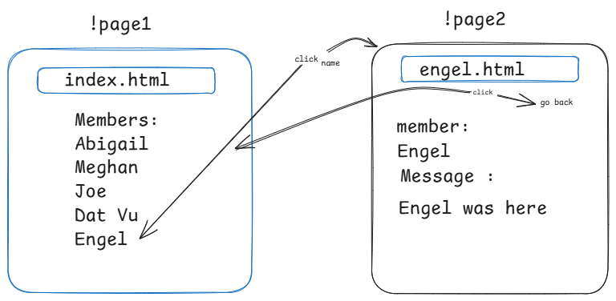

# Team Project Instructions

Hey team! 🎉 We're going to work together on a fun project where we'll create web pages, and we'll use GitHub and VS Code to help us! Our goal is to make a simple website with a list of names. Each person’s name will link to their own special page with a cool message. Let’s break it down step by step:

## 1. GitHub Setup
- GitHub is like a big folder where we all put our work together, and it helps us keep track of changes.
- We'll create one main folder (called a repository) on GitHub. Everyone will work from there.

## 2. Your Page (Using VS Code)
- You’re going to create your own page! The page should be HTML (and if you want, you can use CSS to make it look fancy, but it's optional).

## 3. What's on Your Page?
- Your page needs to have:
  1. **Your Name** displayed on it (big and bold if you want!).
  2. A **message** that says, "Your Name was here." (Like: "Engel was here.").
  3. A **Go back** button or link that takes you back to the home page (so people can visit someone else’s page easily).

## 4. Connecting Your Name to Your Page
- On the **home page** (index.html), there will be a list of all the members. When someone clicks your name on the home page, it should take them to your personal page.

## 5. Going Back to the Home Page
- Make sure your page has a **link to go back** to the home page (so we don’t get stuck on just one page!).

## 6. Get Creative!
- This is where you can be creative! You can style your page however you like using CSS (colors, fonts, backgrounds, etc.), but at the very least, it must have your name, the message, and the go-back link.

## 7. Submitting Your Work
- Once you finish your page, use GitHub to **add your page by branching** to the main folder (repository) we’re all working from. That way, everyone’s pages will be linked to the home page.

## 8. Optional CSS Styling
- Feel free to use CSS to make your page look super cool!

---

## Summary of What We Need:
1. A **home page** that lists all the members.
2. Each member’s name should be clickable, and it should take the visitor to that member’s page.
3. Each **personal page** must:
   - Have the member’s **name**.
   - Show a **message**: "[Your Name] was here."
   - Have a **link to go back** to the home page.
4. Optional: Use **CSS** to make your page look cool!

Let's make sure to have fun and help each other out! 🚀

